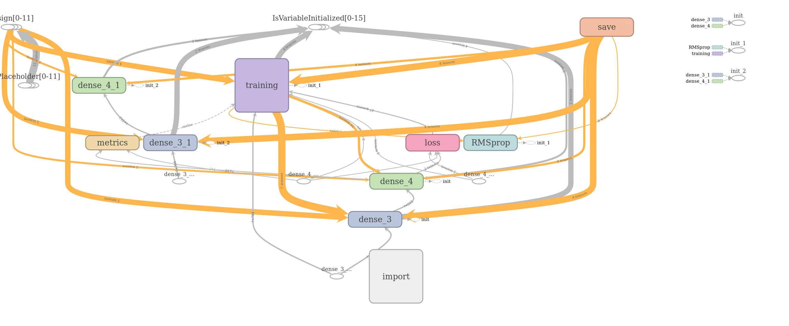

```{r setup, include=FALSE}
knitr::opts_chunk$set(echo = TRUE)
```

```{r includes}

library(keras)
library(here)
library(httr)
library(jsonlite)
library(tidyverse)

# devtools::install_github("rstudio/tfdeploy")
library(tfdeploy)

```

```{r}
# For plotting
# source("https://bioconductor.org/biocLite.R")
# biocLite("Rgraphviz")

library(Rgraphviz)
library(tidygraph)
library(igraph)
```

# Overview

Using tfdeploy to serialize your model after training provides transparency into how your model was created and lets others not only reproduce your work but potentially improve it.

# MNIST MODEL

In the previous example, [hello-keras](hello-keras.html), we trained a model to recognize handwriting. We saved this model and its weights in hdf5 format.

```{r}
model_dense <- load_model_hdf5("models/mnist_hdf5.h5")
```

You can also read in model weights. Weights are loaded based on the model's architecture, so it should be the same as when the weights were saved. 

Note that layers that don't have weights are not taken into account, so adding or removing layers is fine as long as they don't have weights. Also note that if the by_name parameter is TRUE, weights are loaded into layers only if they share the same name. This is useful for fine-tuning or transfer-learning models where some of the layers have changed. We'll talk about naming layers later.

```{r}
load_model_weights_hdf5(model_dense, "models/mnist_weights_hdf5.h5")
```

# Improve the Model

Let's use a 2d convnent instead of dense layers.

```{r}

```


# Export the Model

The next step is to export the model as a TensorFlow SavedModel using the export_savedmodel() function:

```{r}
export_savedmodel(model, "models/savedmodel")
```

Note the message that is printed: exporting a Keras model requires setting the Keras “learning phase” to 0. In practice, this means that after calling export_savedmodel you can not continue to train models in the same R session.

It is important to assign reasonable names to the the first and last layers. For example, in the model code above we named the first layer “image” and the last layer “prediction”.

```{r, eval=FALSE}
model %>%
  layer_dense(units = 256, activation = 'relu', input_shape = c(784),
              name = "image") %>%
  layer_dense(units = 128, activation = 'relu') %>%
  layer_dense(units = 10, activation = 'softmax',
              name = "prediction")
```

The layer names are reflected in the structure of REST requests and responses to and from the deployed model.

You can view the graph of your model using TensorBoard with the view_savedmodel() function:

```{r}
view_savedmodel("models/savedmodel")
```




## Serve the Model

Use serve_savedmodel() to host the model locally. Once running, make an HTTP POST request:

```{r eval=FALSE}
curl_cmd <- 'curl -X POST "http://127.0.0.1:8089/predict/predict/" \ 
  -H "accept: application/json"                       \
  -H "Content-Type: application/json"                 \
  -d "{ \"instances\": [ { \"disp\": [ 160 ], \"cyl\": [ 4 ] } ]}"'

model_req <- GET("http://127.0.0.1:8089/predict/predict/") # req <- GET(req_url, query, accept(accept_text))
```

Each instance of new data should be formatted as a json array, and each element in the array should be a named array corresponding to the feature columns. This structure is similar to a named list in R.

```{r eval=FALSE}
# parse json
model_json <- content(model_req, as = "text")

# rectangularize
 model_df <- fromJSON(json, flatten=TRUE)
```


The response is the predicted MPG:

{
  "predictions": [
    {
      "predictions": [
        8.4974
      ]
    }
  ]
}


# Using Saved Models

https://tensorflow.rstudio.com/tools/tfdeploy/articles/saved_models.html

