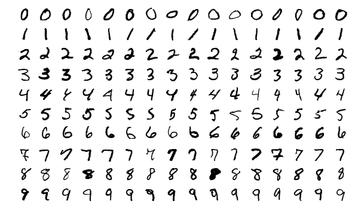
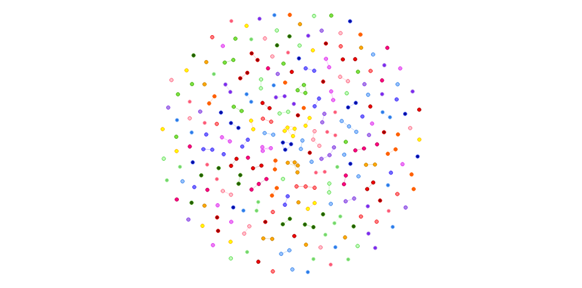

# Library

We're using RStudio's Keras Library.

```{r includes, message=FALSE, warning=FALSE}

library(here)
library(keras)
library(tidyverse)
```

# The Question

Can we identify single digit numbers from hand-writing?

We need to simplify this for our model, as is typical when testing a hypothesis. The question we have for this experiment is "What number is in this picture?"

In this example, we are essentially testing the results of another research effort ^[[Y. LeCun, L. Bottou, Y. Bengio, and P. Haffner. "Gradient-based learning applied to document recognition." Proceedings of the IEEE, 86(11):2278-2324, November 1998.(http://yann.lecun.com/exdb/publis/index.html#lecun-98)]. 

# The Data - MNIST (Modified National Institute of Standards and Technology) database

The MNIST is a collection of handwritten, single-digit numbers. To learn more, [read the Wikipedia entry](https://en.wikipedia.org/wiki/MNIST_database).

## How do we get it?

The `dataset_mnist()` function fetches a formatted archive of the MNIST database that can be consumed in R. This function will cache the dataset locally by default by saving it in ~/.keras/datasets.

```{r model}
mnist <- dataset_mnist()
```

## What's in it?

We have 2 lists, a set of images and a set of labels. The labels map to the images in a 1:1 relationship. That is, the label's index matches the image's index. Our machine will "learn" by looking for similarities between items that have the same label (called "features").

An annotated dataset is one that has labeled content depending on what our end goal is. In this case, the annotations have already been parsed into a structured dataset for our program to consume, but often you'll need to do this parsing yourself. R has some handy tools for streamlining this process (see package `tfdatasets`).

```{r}
str(mnist$train)
```




You might notice our dataset contains 2 lists, train and test. Each is the exact same structure but contains different data. We'll talk about why later. 

## How do we cite it?

One shortcoming of the `dataset_mnist()` function is it does not provide a citation entry. In R, datasets are often provided as standalone packages that can be cited using the `citations()` function.

LeCun, Yann; Corinna Cortes; Christopher J.C. Burges. (1998). MNIST handwritten digit database [Data file]. Retrieved from https://s3.amazonaws.com/img-datasets/mnist.npz

 * Author/Rightsholder. (Year). Title of data set (Version number) [Description of form]. Retrieved from (url) ^[[Per APA Guildelines](http://guides.lib.umich.edu/c.php?g=439304&p=2993299)] 
 * [Use RMarkdown to generate bibliography](https://rmarkdown.rstudio.com/authoring_bibliographies_and_citations.html)
 * [Use citations() for packages](https://stat.ethz.ch/R-manual/R-devel/library/utils/html/citation.html)

Why do you think citing your data sources is important?

# Data Format

Before we can do the deep learnings, we must format our data into something our model can process for comparison. Remember, the model needs to discover what's similar between things that have the same label. Our data needs to match what's required for the function (or mathmatical equation) that will be used to do this comparison

## Making a Tensor

We have two lists, labels and images. Labels and images have a 1:1 mapping. 

Our end goal is to connect the labels to the images.

```{r}
train_images <- mnist$train$x
train_labels <- mnist$train$y
```

We will to be vectorize the lists into a binary matrix, aka a Tensor. 
 
What kind of Tensor are we using?

```{r training-set-images}
paste("How many dimensions does this tensor have?")
length(dim(train_images))

paste("What shape does this tensor have?")
dim(train_images)

paste("What datatype does this tensor have?")
typeof(train_images)

```

What's actually in the dataset?

The first axis (or dimension) is known as the sample axis. If we take a sample out of it, we can display it using the plot function in the R keras library. R provides a function called "as.raster" that tells plot() how to render the data we're passing in.

```{r}
# grab a random index from the "batch" index (the first axis)
digit_index <- sample.int(length(train_images[1,,]), 1) 
digit <- train_images[digit_index,,] # <- one slice of tensor please :)

plot(as.raster(digit, max=255))
```


# Data Encoding

## Tensor Reshaping

To take advantage of the features R Keras offers, our data should be formatted in a way that the `array_reshape()` function can work with. Our end goal is something that can be used for Tensor Operations.

How of you know what shape you need? Generally you can follow the guidelines based on the nature of your question. In this case, we are following a basic "recipe" for image recognition.

We have a 3D array containing image content, width, height
 1. Convert width and height into a single value
 1. Convert the image content into value between 1 and 255

## One Hot Encoding

Convert to a vector of 0's and 1's where the items in the list index are 1 at the appropriate location.

In this example, we transform it into a double array of shape `(60000, 28 * 28)` with values between 0 and 1.

```{r}
train_images <- array_reshape(train_images, c(60000, 28 * 28))
train_images <- train_images / 255

head(train_images)
```

## Labels

We've encoded the images, but also need to categorically encode the labels so the model knows how to bucket things. We will be using the `categorical_crossentropy()` loss function (discussed in the next section), so this method is dictated to us as part of our image recognition recipe. For more information, look at the help entry for `r ?to_categorical`.

```{r}
train_labels <- to_categorical(train_labels)
```

What format does training data generally need to be in? This depends on your question and the methods you will use to run your experiments.

# The Model (aka Network)

A model in Keras is a directed acyclic graph of layers. A graph can also be thought of a network or a map of interconnected points. The connections are "weights" that indicate how each point is related to each other.



The state of the graph (or rather the weights of the connections) are updated as it is trained.

To define our question in terms the model can understand, we'll use layer functions. Each layer function will perform a mathmatical transformation on the dataset and provide a result in a format that lets us "answer" our question. Again, this is dependent on the type of question. In our case we want the model to tell us if an image contains a particular digit.

Models, however, are not going to give us a simple yes or no. Think of it more like a Zen Guru. The final output the model will provide is, given all of the categories, here's the probability that the number is in this picture. It's up to us to interpret the results.

Here's the first bit of code to set up our model.

```{r}
model <- keras_model_sequential() %>% # initialize our model using a pre-baked model type (thanks R keras!)
  layer_dense(units = 512, activation = "relu", input_shape = c(28 * 28)) %>% # define our first layer transformation
  layer_dense(units = 10, activation = "softmax") # define the final layer transformation
```

## keras_model_sequential

R keras provides some "pre-baked" models (much like using a pre-made ingredient instead of cooking everything from scratch). If we look at the help entry, it tells us our model is composed of a linear stack of layers.

By using this function, R keras will send the configuration options to Keras and ultimately Tensorflow so we don't have to fiddle with it.

`r ?keras_model_sequential`

## Layers

What are layers?

Layers are representations of the data that will be chained together for the deep learnings. Remember the connections in the graph? That's essentially what the layer function is building. As each layer function is applied to the dataset, the result then goes to the next layer function we've defined. 

Ultimately, we want to get from many parameters to a set of probabilities. This data transformation can get pretty complex and it is one of the reasons why transparency in deep learning is challenging.
 
We will not discuss the "how" only the "why" so advanced apologies for the hand-waving in place of the actual math. If you want to dig deeper, see the resources mentioned at the end of this notebook.

 * units
 * activation
 * input_shape

### Types of Layers

For image perception problems, two layer types we'll discuss are "dense" and "convnet" ^[not to be confused with convents, totally different thing... that was a joke ;)].

The `layer_dense()` function indicates we are using "dense" layers. Dense layers are intended to process vectors with no specific structure to the input features. The units of a dense later are all connected and the layer function attempts to map relationships between any features.

The key difference between a dense layer and a 2D convolution layer is that the convolution layer additionally learns "local" patterns of features, rather than considering all of them each iteration.

The advantage to using a Convnet is we can see how the image perception was transformed over time. We'll take a look at that after we finish training our first example. The takeaway here is there are many types of layers that dictate how we need the data transformed so the model can answer our question. It's up to you to find the best approach depending on the nature of your question.

## Tensor Operations 

When our model does its magic, it will reduce many values into a single value.

Why a single value? Because ultimately we're trying to get to a "gradient". The gradient is the change (curve or interval) of a tensor operation. Basically it's how we contain the many dimensions into a single value. This value represents momentum.

This might be overly simplistic, but if this is a new concept or not intuitive this idea might help. Imagine how you think of a bicycle in motion. As it goes from point A to point B its speed changes slightly. A "gradient" is a way of describing, in a single value, how the speed changed over time as the bicycle went from point A to point B.

We'll plot what this looks like after we've done the training so it makes more sense.

### Relu

Relu performs operations on each entry of the tensors being considered and takes the maximum value.

Transformation happens with the following formula: `output = relu(dot(W, input) + b)`

What are the pieces?

 * output = resulting tensor (what the layer function returns)
 * input = incoming tensor, either what we start with or the result of the last layer function
 * "W" and "b" are Weights
 * W = kernel
 * b = bias
 
By "weights" we mean the features that affect the output, or in our case the probability that our image matches a particular label. The goal of our model is to pick out the features within the image data that appear to be tied to a matching label so it can tell us with a high degree of certainty whether an image contains a particular number.
 
Initially these are random but future iterations will adjust based on the result of a feedback function we'll discuss in the next section.

Here's an example of what relu looks like under the hood

```{r}
basic_relu <- function(my_2d_tensor) {
  for (row in nrow(my_2d_tensor)) {
    for (column in ncol(my_2d_tensor)) {
      # the individual entry
      my_2d_tensor[row, column] <- max(my_2d_tensor[row, column], 0)
      
    }
  }
}
```


### The Final Transformation

The final layer uses a different transformation than the rest of them. This is our "last layer activation" and it transforms the model representation into something that we can use to answer our question. 

We are using `softmax` because it goes with the `categorical_crossentropy` loss function. 

The type activation you use at this point is dictated by the type of question your experiment is exploring!

## Compile

What does it mean to compile a model? What does compile actually do?

R's keras is an interface to the Python library, so the model is not fully "stored" in R. Compile sets additional attributes in the Python representation of the model. Anytime you change a model attribute you must run compile to update the Python representation of the model or else the changes won't be reflected when you go to train it.

The model needs three things before we can train it:

 1. how it will measure its performance as it trains
 1. what it will measure ^^ 
 1. how it will update itself in response to its measure of its own performance
 
Note that you can specify these when you initialize the model above, there is no need to separate them. It's just done so here because a) the thing I'm referencing did it and b) to break it up conceptually for teaching.

```{r}
model %>% compile(
  optimizer = "rmsprop",
  loss = "categorical_crossentropy",
  metrics = c("accuracy")
)
```

## Optimizer

The optimizer determines the rate at which the model learns. You can see a list of available optimizers in R keras by searching the Help for "optimizer_".

We'll use `RMSProp`

## Loss Function

`categorical_crossentropy` is the loss function used as the feedback signal for learning the weight tensors. This method is used when each sample (or image in this case) has exactly one class it can belong to. That is, in our set, an image can only be ONE of the 9 digits, it can't be both. The loss function you use will be dictated by the nature of your question!

## Metrics

We're going to use "accuracy".

## Setting Something Aside

Before you train your model on your dataset, you should to put some of your data aside for the validation process. Our dataset already includes a test set, so we'll use that for now.

You can think of this as a control group. The attributes we specified above will also be used on this "pristine" set of data the model has never encountered before. We'll show what that looks like after the training step has occurred.

There are different approaches to validation and not all of them require setting some data aside, because sometimes you can't. We'll touch on that when we show the results of the testing process after the training step!

```{r testing-set-images}
test_images <- mnist$test$x
test_images <- array_reshape(test_images, c(10000, 28 * 28))
test_images <- test_images / 255
```

```{r testing-set-labels}
test_labels <- mnist$test$y
test_labels <- to_categorical(test_labels)
```

## So What Have We Got?

The model we've built is a small convnet. It is a stack of alternated 2d layers with relu activation.

By default the model will print layer metadata.
```{r}
model
```

To see a layer, we can call it by name.

```{r eval=FALSE}
# replace the "" with the name of one of the layers printed in the previous step
get_layer(model, name="dense_31")
```

We can also get the weights.

```{r}
get_weights(model)
```

More information on saving your model to a text file is discussed further on.

# Train 

What is the probability that the image belongs to one of the 10 different categories?

The `fit()` function is how we'll trigger the training loop. It trains model for fixed number of iterations and it returns a "history" object with all info collected during training.

```{r, echo=TRUE, results='hide'}
history <- model %>% fit(train_images, train_labels, epochs = 5, batch_size = 128)
```

## The Training Loop

 1. Get a batch of images and the corresponding labels
 1. Run the layer function on the images to obtain predictions on whether the image matches the label
 1. Compute the loss by looking at the rate of mismatch between the image and the label
 1. Update the weights (how things are interconnected/related) to reduce the loss

## Saving the Model

There are many ways to save your model. It's usually a good idea to save it after training for evaluation. You can also include it in your Github repo where you've saved your research notebook!

You can save it in human-readable form using either YAML or JSON.

```{r}
write(model_to_yaml(model), "models/mnist_dense.yaml")
```

The human-readable options for serializing the models don't include all of the information. The serialize_model command actually calls the Keras Python library to get the data that is not immediately available within the R objects.

All options are not included by default, however, such as the optimizer. You need to explicitely indicate what additional attributes you want included. When might this be useful?

```{r}
raw_model <- model
write(serialize_model(raw_model), "models/mnist_raw.txt")
```

You can also explicitely save it as HDF5

```{r, eval=FALSE}
save_model_hdf5(model, filepath = "models/mnist_dense_hdf5.h5")
save_model_weights_hdf5(model, filepath="models/mnist_dense_weights_hdf5.h5")
```

The next section, Reproducibility, shows how to export your model as a TensorFlow SavedModel for deployment.

# Validation

## Test Data

You typically don't want to test your model on the same data its already been trained on. You can think of this as the "control group". That said, there are methods that can be used when the test set and the training set overlap or are the same.

### Set Some Data Aside 

In this case, the dataset already had samples set aside for testing. We'll talk about this later, but just know that depending on your testing method, you might need to pull out some samples before your training run.

```{r}
metrics <- model %>% evaluate(test_images, test_labels, verbose = 0)

metrics
```

## Visualizing the results

This plot shows the curve of loss and the accuracy during training

```{r}
# no lines on the plot for some reason
plot(history)
```

# Run the Example

Here are all the steps in one code chunk. Challenge - write comments describing what each line does.

```{r, results='hide'}
library(keras)

mnist <- dataset_mnist()
train_images <- mnist$train$x
train_labels <- mnist$train$y
test_images <- mnist$test$x
test_labels <- mnist$test$y

model <- keras_model_sequential() %>% 
  layer_dense(units = 512, activation = "relu", input_shape = c(28 * 28)) %>% 
  layer_dense(units = 10, activation = "softmax")

model %>% compile(
  optimizer = "rmsprop",
  loss = "categorical_crossentropy",
  metrics = c("accuracy")
)

train_images <- array_reshape(train_images, c(60000, 28 * 28))
train_images <- train_images / 255

test_images <- array_reshape(test_images, c(10000, 28 * 28))
test_images <- test_images / 255

train_labels <- to_categorical(train_labels)
test_labels <- to_categorical(test_labels)

metrics <- model %>% evaluate(test_images, test_labels, verbose = 0)

history <- model %>% fit(train_images, train_labels, epochs = 5, batch_size = 128)
```

```{r}
# not sure why lines aren't showing up in the plot :/

plot(history)
```

```{r}
metrics
```

# Predicting the Outcomes

So, how did we do? Did our model successfully identify the numbers?

In R, it is easy to make predictions using the the trained model and R’s predict function. Each row represents an image, each column represents a digit from 0-9, and the values represent the model’s prediction.

To make this easier to read, we've used the tidyverse to summarize the data using the maximum probability for each digit. This only looks at the maximum probability, what alternative approaches could we use for more complex predictions?

```{r}
preds <- predict(model, test_images)
preds_df <- as.data.frame(preds)
names(preds_df) <- c(0:9) # wasn't working in the data.frame cast for some reason

predictions <- preds_df %>% 
  mutate(digit_index = row_number()) %>%
  gather(number, probability, 1:10)

predictions_summary <- predictions %>%
  group_by(digit_index) %>%
  summarize(likely_number = number[which.max(probability)])

```

Let's look at a random sample of images to see how our predictions did. Do you see any where the predicted value does not match the image? How might you show the top probabilities overall?

```{r}
predictions_summary_sample <- sample_n(predictions_summary, 24)

for (n in predictions_summary_sample$digit_index) {
  pred_img <- mnist$test$x[n,,]
  plot(as.raster(pred_img, max=255))
  title(paste("Predicted number for index", n, ":", predictions_summary$likely_number[n]))
}
```

# Conclusion

We were able to successfully recognize single digits from handwriting!


# Next Steps

 * Better ways to visualize prediction
 * use 2d convnet instead of dense (p112) 
 * visualize the stages of the covnet visualization (see example 5.3 in Deep Learning with R)

# Deepen your Learning

 * [Deep Learning with R by JJ Allaire](https://www.manning.com/books/deep-learning-with-r)
 * [Deep Learning with R Examples](https://github.com/jjallaire/deep-learning-with-r-notebooks)
 * [Machine Learning for Humans](https://medium.com/machine-learning-for-humans/why-machine-learning-matters-6164faf1df12)
 * [Tensorflow Tools for R by RStudio](https://tensorflow.rstudio.com/)
 * [DataCamp] <- TODO - add the link to Gabi and Erin's ML course
 * Linear Algebra Fast.ai


